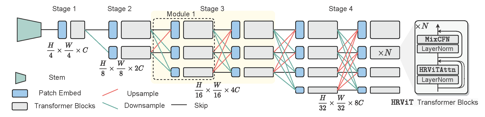

# HRViT

This repo is the official implementation of ["Multi-Scale High-Resolution Vision Transformer for Semantic Segmentation"](https://arxiv.org/abs/2111.01236).

## Introduction

**HRViT** is introduced in [arXiv](https://arxiv.org/abs/2111.01236), which is a new vision transformer backbone design for semantic segmentation. It has a multi-branch high-resolution (HR) architecture with enhanced multi-scale representability. We balance the model performance and efficiency of HRViT by various branch-block co-optimization techniques. Specifically, we explore heterogeneous branch designs, reduce the redundancy in linear layers, and augment the attention block with enhanced expressiveness.

HRViT achieves 50.20% mIoU on ADE20K and 83.16% mIoU on Cityscapes, surpassing state-of-the-art MiT and CSWin backbones with an average of +1.78 mIoU improvement, 28% parameter saving, and 21% FLOPs reduction.



## Main Results on ImageNet

| model | pretrain | resolution | acc@1 | #params | FLOPs |
|:---:  | :---:    |  :---:     | :---: |   :---: | :---: |
| HRViT-b1 | ImageNet-1K  | 224x224 | 80.5 | 19.7M  | 2.7G  |
| HRViT-b2 | ImageNet-1k  | 224x224 | 82.3 | 32.5M  | 5.1G  |
| HRViT-b3 | ImageNet-1k  | 224x224 | 82.8 | 37.9M  | 5.7G |


## Main Results on Semantic Segmentation

**ADE20K Semantic Segmentation (val)**

| Backbone | Method | pretrain | Crop Size | Lr Schd | mIoU | #Params | FLOPs |
| :---: | :---: | :---: | :---: | :---: | :---: | :---: | :---: |
| HRViT-b1 | Segformer | ImageNet-1K | 512x512 | 160K | 45.88 | 8.2M | 14.6G |
| HRViT-b2 | Segformer | ImageNet-1K | 512x512 | 160K | 48.76 | 20.8M | 28.0G |
| HRViT-b3 | Segformer | ImageNet-1K | 512x512 | 160K | 50.20 | 28.7M | 67.9G |
| HRViT-b1 | UperNet | ImageNet-1K | 512x512 | 160K | 47.19 | 35.9M | 219G |
| HRViT-b2 | UperNet | ImageNet-1K | 512x512 | 160K | 49.10 | 49.7M | 233G |
| HRViT-b3 | UperNet | ImageNet-1K | 512x512 | 160K | 50.04 | 55.4M | 236G |


**Cityscapes Semantic Segmentation (val)**

| Backbone | Method | pretrain | Crop Size | Lr Schd | mIoU | #Params | FLOPs |
| :---: | :---: | :---: | :---: | :---: | :---: | :---: | :---: |
| HRViT-b1 | Segformer | ImageNet-1K | 512x512 | 160K | 81.63 | 8.1M | 14.1G |
| HRViT-b2 | Segformer | ImageNet-1K | 512x512 | 160K | 82.81 | 20.8M | 27.4G |
| HRViT-b3 | Segformer | ImageNet-1K | 512x512 | 160K | 83.16 | 28.6M | 66.8G |


Training code could be found at [`segmentation`](segmentation)

## Requirements

timm==0.3.4, pytorch>=1.4, opencv, ... , run:

```
bash install_req.sh
```

Data preparation: ImageNet-1K with the following folder structure, you can extract imagenet by this [script](https://gist.github.com/BIGBALLON/8a71d225eff18d88e469e6ea9b39cef4).

```
│imagenet/
├──train/
│  ├── n01440764
│  │   ├── n01440764_10026.JPEG
│  │   ├── n01440764_10027.JPEG
│  │   ├── ......
│  ├── ......
├──val/
│  ├── n01440764
│  │   ├── ILSVRC2012_val_00000293.JPEG
│  │   ├── ILSVRC2012_val_00002138.JPEG
│  │   ├── ......
│  ├── ......
```

## Train

Train three variants: HRViT-b1, HRViT-b2, and HRViT-b3. We need 4 nodes/machines, 8 GPUs per node.
On machine `NODE_RANK`={0,1,2,3}, run the following command to train `MODEL`={HRViT_b1_224, HRViT_b2_224, HRViT_b3_224}
```
bash train.sh 4 8 <NODE_RANK> --data <data path> --model <MODEL> -b 32 --lr 1e-3 --weight-decay .05 --amp --img-size 224 --warmup-epochs 20 --drop-path 0.1 --head-drop 0.1 --clip-grad 1 --sync-bn
```

If the GPU memory is not enough, please use [gradient checkpoint](https://pytorch.org/docs/stable/checkpoint.html) '--with-cp'.


## Cite HRViT

```
@misc{gu2021hrvit,
      title={Multi-Scale High-Resolution Vision Transformer for Semantic Segmentation},
        author={Jiaqi Gu and Hyoukjun Kwon and Dilin Wang and Wei Ye and Meng Li and Yu-Hsin Chen and Liangzhen Lai and Vikas Chandra and David Z. Pan},
        year={2021},
        eprint={2111.01236},
        archivePrefix={arXiv},
        primaryClass={cs.CV}
}
```


## Acknowledgement

This repository is built using the [timm](https://github.com/rwightman/pytorch-image-models) library, the [DeiT](https://github.com/facebookresearch/deit) repository, and the [CSWin](https://github.com/microsoft/CSWin-Transformer) repository.

## License
This project is licensed under the license found in the LICENSE file in the root directory of this source tree.

[Meta Open Source Code of Conduct](https://opensource.fb.com/code-of-conduct)

### Contact Information

For help or issues using HRViT, please submit a GitHub issue.

For other communications related to HRViT, please contact Hyoukjun Kwon (`hyoukjunkwon@fb.com`), Dilin Wang (`wdilin@fb.com`).

## License Information
The majority of HRViT is licensed under CC-BY-NC, however portions of the project are available under separate license terms: CSWin Transformer is licensed under the MIT license.